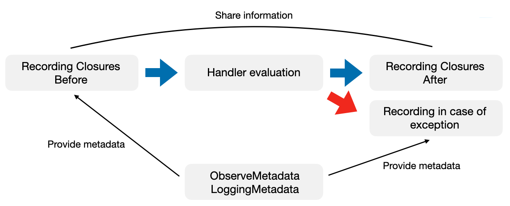

# Observe a web service

Instrument an Apodini web service to make it observable.

<!--
                  
This source file is part of the Apodini open source project

SPDX-FileCopyrightText: 2019-2021 Paul Schmiedmayer and the Apodini project authors (see CONTRIBUTORS.md) <paul.schmiedmayer@tum.de>

SPDX-License-Identifier: MIT
             
-->

## Overview

In order to make in instrumentation of the web service as easy as possible for developers, Apodini provides the `ApodiniObserve` package. The goal of the library is to simplify the observability process within the declarative Apodini framework, remove hurdles for developers to instrument the entire web service extensivly, and allows them to easily state observability features in the DSL of Apodini. Developers have to write as little code as possible in order to achieve observability by using ApodiniObserve’s convenience features. Furthermore, the package is able to automate the observing process completely by collecting default information about the execution of the web service with only a few lines of code written by the developer.

`ApodiniObserve` heavily relies on Apple's observability libraries, especially [swift-log](https://github.com/apple/swift-log) and [swift-metrics](https://github.com/apple/swift-metrics), to provide instrumentation possibilities to developers. It's important to note that these packages just define an observability API ("observability frontend"), but don't actually process and transmit the insturmented telemetry information to an observability software stack. This functionality is left to individual observability integrations ("observability backends") that conform to the processing APIs of Apple’s observability libraries. A list of compatible observability integrations can be found on [GitHub page of swift-log](https://github.com/apple/swift-log) as well as [GitHub page of swift-metrics](https://github.com/apple/swift-metrics).

All in all, `ApodiniObserve` provides functionality to easily collect information about the system's execution in the form of logs and metrics. These observability types are automatically enrichted by adding context information to them in order to extract actionable insights from the information. Furthermore, as mentioned before, the entire observability process can be automated by `ApodiniObserve` to a certain extent by collecting configurable default observability types, so that developers don't have to manually instrument the different web routes themselves.

## Logs

The first building block of observing a software system are Logs. An event log, or often commonly called a log, is a sequence of immutable textual records generated in response to a discrete event consisting of a timestamp, a log level, a context, and a payload. Logs are often used by developers to debug rarely occurring events. They enable instrumenting the code in-depth by providing lots of context and detailed information about the arisen event. As such, logs provide valuable insights for detecting unpredictable system behaviors and make lots of context information available to the developer which allows them to pinpoint the underlying fault more quickly.

Therefore, `ApodiniObserve` provides an `ApodiniLogger` that drastically simplifies the logging process in an Apodini web service.
As explained above, it is important to note that the `ApodiniLogger` just defines the API of the logger, the actual processing and transmission to different obserevability software stacks like [Elastic](https://www.elastic.co/elastic-stack/) is done by so called "obervability backends", in the case of a logger a `LogHandler`. These `LogHandler`'s are compatible with the API for "obervability backends" defined by the [swift-log](https://github.com/apple/swift-log) package. This enables developers to easily write their own `LogHandler` and publish them open-source. A list of compatible `LogHandler`'s can be found on [GitHub page of swift-log](https://github.com/apple/swift-log).

As a standalone package, the `ApodiniLogger` is only able to direct its logs to the most basic `LogHandler`, which simply prints the logs to stdout. To direct logs to more advanced observability software stacks like the [Elastic stack](https://www.elastic.co/elastic-stack/), developers can use already existing open-source `LogHandler`'s. In the case of the [Elastic stack](https://www.elastic.co/elastic-stack/), this would be a `LogHandler` that sends the logs to [Logstash](https://www.elastic.co/logstash/) which then ingests the data to [ElasticSearch](https://www.elastic.co/elasticsearch) which can then be visualized by [Kibana](https://www.elastic.co/kibana/). After taking a look at the available `LogHandler`'s on the [GitHub page of swift-log](https://github.com/apple/swift-log), in our example the developer decides to utilize the [swift-log-elk](https://github.com/Apodini/swift-log-elk) `LogHandler` as the "obervability backend" for the `ApodiniLogger`. Note that the `ApodiniLogger` works with all `LogHandler`'s, not only the mentioned Logstash `LogHandler`.

### Add Target Dependency

In order to use the `ApodiniLogger` in combination with an appropriate `LogHandler`, the developer first has to state the dependency `ApodiniObserve` in the target as well as the dependency to the respective `LogHandler` package, in the case of the Logstash example the [swift-log-elk](https://github.com/Apodini/swift-log-elk) package.

```swift
dependencies: [
    .package(url: "https://github.com/Apodini/Apodini.git", from: "0.5.0"),
    .package(url: "https://github.com/Apodini/swift-log-elk.git", from: "0.2.0")
],
targets: [
    .executableTarget(
        name: "WebService",
        dependencies: [
            .product(name: "Apodini", package: "Apodini"),
            .product(name: "ApodiniObserve", package: "Apodini"),
            .product(name: "LoggingELK", package: "swift-log-elk")
        ]
    ),
]‚
```

### ApodiniLogger Configuration

After stating the dependencies to the respective packages, the developer first has to configure the `ApodiniLogger` with the to-be-used `LogHandler`'s.
Add the `LoggerConfiguration` to the `configuration` property of the `WebService` and specify the to be used `LogHandler`'s (in this example only the `LogstashLogHandler`), the global logLevel as well as a developer-defined configuration closure, that sets up the to be used `LogHandler`'s (for example the network address of the `Logstash` component). In order to set up multiple `LogHandler`'s, just pass multiple `LogHandler`'s in the initializor.

```swift
import Apodini
import ApodiniObserve
import LoggingELK

struct ExampleWebService: WebService {
    var content: some Component {
        // ...
    }
    
    var configuration: Configuration {
        // ...

        // Setup of ApodiniLogger with a LogstashLogHandler backend
        LoggerConfiguration(logHandlers: LogstashLogHandler.init,
                            logLevel: .info) {
            LogstashLogHandler.setup(
                hostname: "0.0.0.0",
                port: 31311
                // further configurations possible
            )
        }
    }
}
```

### Instrument

After configuring the `ApodiniLogger`, it is ready to be used in the ``WebService`` and the different ``Handler``'s it offers.
In the example below, a new `SensorType` is created in a database. In order to get insights into the execution of this ``Handler`` at runtime, it is instrumented via logging statements with the `ApodiniLogger`. The logger that is stated as a property in the ``Handler`` has to be annotated with the `ApodiniLogger` property wrapper. This property wrapper instanciates and configures the logger correctly (automatically assigns an appropriate label etc.), so that the developer can directly start using it. 

The `ApodiniLogger` offers a range of functions corresponding to the different logLevels, like `.info()`, `.error()`, or `.critical()`. Depending on the currently configured logLevel, these messages are either filtered out (as their relevance isn't high enough) or further processed. Furthermore, each logging statement can be passed an extra metadata struct that contains application-specific data that may be relevant to site reliability engineers.

```swift
import Apodini
import ApodiniObserve
import Shared

struct CreateSensorType: Handler {
    @Environment(\.databaseModel)
    var databaseModel: DatabaseModel
    
    @Parameter(.http(.body))
    var sensorTypeContent: SensorType
    
    @Throws(.serverError, reason: "Sensor type couldn't be saved correctly")
    var serverError: ApodiniError
    
    @ApodiniLogger
    var logger

    func handle() async throws -> SensorType {
        guard let sensorType = try? await databaseModel.createSensorType(sensorTypeContent) else {
            logger.error("Couldn't create new sensor type with ID \(sensorTypeContent.id)", metadata: ["sensorTypeID": .string(sensorTypeContent.id?.description)])
            throw serverError
        }
        
        logger.info("New sensor type with ID \(sensorTypeContent.id) created")
        
        return sensorType
    }
}
```

Further configuration possibilities of the `ApodiniLogger` are a custom ID, custom label and logLevel, that overwrites the globally configured logLevel of the `LoggerConfiguration`. Furthermore, the level of automatically collected metadata can be configured (`.all`, `.reduced`, `.none`, `.custom(metadata: [String])`, for further information take a look at the section below) as well as a custom `LogHandler` the overwrites the globally configured `LogHandler`'s.
```swift
import Apodini
import ApodiniObserve

struct CreateSensorType: Handler {
    @ApodiniLogger(id: UUID(),
                   label: "org.apodini.logger.test",
                   logLevel: .info,
                   metadataLevel: .reduced,
                   logHandler: LogstashLogHandler.init)
    var logger
}
```

### Automatic context aggregation

A unique functionality of the `ApodiniLogger` is the ability to automatically attach context information to the log messages to enrich the logged information. Context information is very important in the logging process in order to comprehend the system's execution in retrospect and beeing able to quickly localize the underlying fault. Therefore, the `ApodiniLogger` automatically attaches data about the ``Connection``, the used ``InterfaceExporter``, and the ``Endpoint`` to the log messages as well as the Apodini ``Information`` data struct which, for example in the case of the REST exporter, contains HTTP header values. Furthermore, data about the ``Request`` itself like parameters or content type are automatically attached to log messages. 

The context information is inserted as `Logger.Metadata` to the log messages which will then be further processed by the `LogHandler`'s to enrich the logging messages.
The structure of the context information is as follows:
- connection
    - remoteAddress
    - state
    - eventLoop
- request
    - description
    - parameters
    - *Further data dependent on the exporter*
- information
    - *Data ependent on the exporter, like HTTP Headers for REST*
- endpoint
    - name
    - endpointParameters
    - operation
    - endpointPath
    - version
    - handlerReturnType
    - communicationalPattern
- exporter
    - type
    - parameterNamespace

This functionality can also be configured by the user via the initializer of the `ApodiniLogger` (see above). Depending on the comprehensiveness of the context information, developers can state the `.all`, `.reduced`, `.none`, and `.custom(metadata: [String])` metadata levels, which scale down the size of the collected information and therefore result in speed improvements. Even a custom configuration is possible, in which the developer can pass the first-level keys of the context information that is desired. Possible first-level keys are:
- connection
- request
- information
- endpoint
- exporter

## Metrics

Another building block of observing software systems are Metrics. A metric is a numeric representation of data measured over a certain time interval. Since metrics can be broken down into simple numbers, they can be aggregated and performed mathematical operations and modeling upon. These models can even be stretched out in order to predict future system behavior from data collected in the past. These properties make metrics well suited to visually present captured information in a dashboard that reflects historical trends.

In order to easily instrument an Apodini web service with Metrics, `ApodiniObserve` provides `ApodiniMetric` types, namely an `ApodiniCounter`, `ApodiniGauge`, `ApodiniHistogram`, `ApodiniRecorder`, and an `ApodiniTimer`. A Counter is a cumulative, monotonically increasing metric, allowing only to increase the wrapped value or to reset it to zero, and is typically used to measure the number of incoming requests or occurred errors. A Gauge on the other hand wraps a numeric value that can arbitrarily go up or down and is therefore mostly used to record CPU utilization or memory usage. A Recorder observes values over a certain time frame and allows to perform aggregations on the collected information. A Timer is a more specialized form of a Recorder, focused on observing time values like the response time of a request.

Similar to the `ApodiniLogger`, the `ApodiniMetric` types are based upon the Apple observability library [swift-metrics](https://github.com/apple/swift-metrics). As mentioned before, these library just defines an API ("observability frontend") which the `ApodiniMetric` types reuse, the actual processing of the metrics data is done via `MetricHandler`'s ("observability backends"), namely the `CounterHandler`, `RecorderHandler`, and `TimerHandler`. Developers are free to implement and publish these `MetricHandler`'s on their own as they are defined as a protocol in the [swift-metrics](https://github.com/apple/swift-metrics) library. A list of already available, open-source `MetricHandler`'s can be found on the [GitHub page of swift-metrics](https://github.com/apple/swift-metrics). These `MetricHandler`'s process and transfer the metrics data to a respective observability software stack. One of the most popular tools for metrics is [Prometheus](https://prometheus.io/). A fitting `MetricHandler` is the [SwiftPrometheus](https://github.com/MrLotU/SwiftPrometheus) package, which this article will use as an example. Note that the `ApodiniMetric` types work with all `MetricHandler`'s, not only the mentioned Prometheus `MetricHandler`.

### Add Target Dependency

In order to use the `ApodiniMetric` types in combination with an appropriate `MetricHandler`, the developer first has to state the dependency `ApodiniObserve` in the target as well as the dependency to the respective `MetricHandler` package, in the case of the Prometheus example the [SwiftPrometheus](https://github.com/MrLotU/SwiftPrometheus) package.

```swift
dependencies: [
    .package(url: "https://github.com/Apodini/Apodini.git", from: "0.5.0"),
    .package(url: "https://github.com/MrLotU/SwiftPrometheus.git", from: "1.0.0-alpha")
],
targets: [
    .executableTarget(
        name: "WebService",
        dependencies: [
            .product(name: "Apodini", package: "Apodini"),
            .product(name: "ApodiniObserve", package: "Apodini"),
            .product(name: "SwiftPrometheus", package: "SwiftPrometheus")
        ]
    ),
]‚
```

### ApodiniMetrics Configuration

After stating the dependencies to the respective packages, the developer first has to configure the `ApodiniMetric` types with the to-be-used `MetricHandler`'s.
Add the `MetricsConfiguration` to the `configuration` property of the ``WebService`` and specify the to be used `MetricsFactory`'s (in this example only the `PrometheusMetricsFactory`) as well as a configuration for automatically collecting system metrics, so CPU utilization, free memory, or open file descriptors. 
In comparison to the `LoggerConfiguration`, the `MetricsConfiguration` is more complex as there are different types of metrics software stacks available:
- The most typical kind, a pull-based metrics software, for example Prometheus, pulls the metrics data from a specific system in a certain time interval. This results in the need for the software system to provide an endpoint (most typically a "/metrics" endpoint) where the metrics data can be fetched from by Prometheus. In `ApodiniObserve` this behaviour corresponds to the `MetricPullHandlerConfiguration`. This configuration type takes a factory, so the to-be-used `MetricHandler`'s, an endpoint where the metrics data should be exposed, as well as a custom collection closure that returns the temporarily stored metrics data that should then be served by the metrics endpoint.
- On the other hand, a push-based metrics software pushes the metrics data directly to a metrics software, therefore the configuration with `ApodiniObserve` is more simple. n `ApodiniObserve` this behaviour corresponds to the `MetricPushHandlerConfiguration`. This configuration only takes a factory of the to-be-used `MetricHandler`'s, as the transmission logic is already implemented by the `MetricHandler` themselves.
In order to set up multiple `MetricHandler`'s, just pass multiple `MetricPullHandlerConfiguration` or `MetricPushHandlerConfiguration`'s in the initializor.

Furthermore, `ApodiniObserve` offers the automatic collection of system metrics, as described above. The developer is able to configure if data should be collected at all (`.on(configuration: SystemMetrics.Configuration)`, `.off`) and what types should be collected in what interval. It also offers a `.default` option, which automatically collects all available system metrics every second. Currently, the ability to collect system metrics is limited to Linux-based systems.


```swift
import Apodini
import ApodiniObserve
import Metrics
import Prometheus

struct ExampleWebService: WebService {
    var content: some Component {
        // ...
    }
    
    var configuration: Configuration {
        // ...

        // Setup of ApodiniMetrics with a PrometheusMetricsHandler backend
        MetricsConfiguration(
            handlerConfiguration: MetricPullHandlerConfiguration(
                factory: PrometheusMetricsFactory(
                    client: PrometheusClient(),
                    configuration: PrometheusMetricsFactory.Configuration()
                ),
                endpoint: "/metrics",
                collect: { promise in
                    DispatchQueue.global().async {
                        do {
                            try MetricsSystem.prometheus().collect(into: promise)
                        } catch {
                            promise.fail(error)
                        }
                    }
    
                    return promise.futureResult
                }
            ),
            systemMetricsConfiguration: 
                .on(
                    configuration: .init(
                        pollInterval: .seconds(3),
                        dataProvider: nil,
                        labels: .init(
                            prefix: "process_",
                            virtualMemoryBytes: "virtual_memory_bytes",
                            residentMemoryBytes: "resident_memory_bytes",
                            startTimeSeconds: "start_time_seconds",
                            cpuSecondsTotal: "cpu_seconds_total",
                            maxFds: "max_fds",
                            openFds: "open_fds"
                        )
                    )
                )
        )
    }
}
```

As the `MetricsConfiguration` is quite complex, `ApodiniObserve` offers a seperate [`ApodiniObservePrometheus` Swift package](https://github.com/Apodini/ApodiniObservePrometheus) that drastically simplifies the configuration process for the common [Prometheus](https://prometheus.io/) software stack. Include the dependency like:
```swift
dependencies: [
    .package(url: "https://github.com/Apodini/ApodiniObservePrometheus.git", from: "0.0.0"),
],
targets: [
    .executableTarget(
        name: "WebService",
        dependencies: [
            .product(name: "Apodini", package: "Apodini"),
            .product(name: "ApodiniObserve", package: "Apodini"),
            .product(name: "ApodiniObservePrometheus", package: "ApodiniObservePrometheus"),
        ]
    ),
]
```

This then enables a way simpler configuration like:

```swift
import Apodini
import ApodiniObserve
import ApodiniObservePrometheus

struct ExampleWebService: WebService {
    var content: some Component {
        // ...
    }
    
    var configuration: Configuration {
        // ...

        // Setup of ApodiniMetrics with a PrometheusMetricsHandler backend
        MetricsConfiguration(
            handlerConfiguration: MetricPullHandlerConfiguration.defaultPrometheus,
            systemMetricsConfiguration: .default
        )
    }
}
```

### Instrument

After configuring the `ApodiniMetric` types, they are ready to be used in the ``WebService`` and the different ``Handler``'s it offers.
Similar to the example with the `ApodiniLogger`, in the example below, a new `SensorType` is created in a database. In order to get insights into the execution of this ``Handler`` at runtime, it is instrumented via the `ApodiniCounter`. The counter that is stated as a property in the ``Handler`` has to be annotated with the `ApodiniCounter` property wrapper. This property wrapper instanciates and configures the counter correctly, so that the developer can directly start using it. The property wrappers has to be passed a label by the developer, as automatically assign labels don't make sense for `ApodiniMetric` types (in contrast to the `ApodiniLogger`).

Depending on the `ApodiniMetric` types, the metric offers different functionalities. In our case, the `ApodiniCounter` offers a simple `.increment()` function to increase the amount of the `ApodiniCounter` by a specific amount (default is 1). An overview of what functionalities are offered by what `ApodiniMetric` type can be found on the [GitHub page of swift-metrics](https://github.com/apple/swift-metrics).
Furthermore, every `ApodiniMetric` type is automatically enriched by context information, similar to the `ApodiniLogger`. However, as most metrics software stacks efficiently store the metrics data in a time series database, it is important to only include the most relevant context information as otherwise the metrics data storage size blows up. The attached context information includes:
- endpoint
- endpoint_path
- exporter
- operation
- communicational_pattern
- service_type
- response_type

```swift
import Apodini
import ApodiniObserve
import Shared

struct CreateSensorType: Handler {
    @Environment(\.databaseModel)
    var databaseModel: DatabaseModel
    
    @Parameter(.http(.body))
    var sensorTypeContent: SensorType
    
    @Throws(.serverError, reason: "Sensor type couldn't be saved correctly")
    var serverError: ApodiniError
    
    @ApodiniCounter(label: "sensortype_created_counter")
    var sensorTypeCreatedCounter

    @ApodiniCounter(label: "sensortype_failed_counter")
    var sensorTypeFailedCounter

    func handle() async throws -> SensorType {
        guard let sensorType = try? await databaseModel.createSensorType(sensorTypeContent) else {
            sensorTypeFailedCounter.increment()
            throw serverError
        }
        
        sensorTypeCreatedCounter.increment()
        
        return sensorType
    }
}
```

A further configuration possibility of the `ApodiniMetric` types is to manually pass labels to the initializer of the `ApodiniMetric` property wrapper. These labels will be merged with the automatically attached context information.

## Continuous Observability

Until now, the documentation has introduced features of ApodiniObserve that enable developers to manually instrument ``Handler``’s in order to collect observability data. However, as mentioned in the introduction, `ApodiniObserve` also offers functionalities to completly automate the instrumentation process in an `Apodini` ``WebService``. This means that developers only have to specify once what telemetry data should be collected for what parts of the ``WebService``, `ApodiniObserve` will then automatically instrument these ``Handler``'s without further interactions by the developers. `ApodiniObserve` offers a range of default observability data that can be configured to be collected and also offers the developer the ability to define own observability data that should be colleced for the entire or parts of the ``WebService``.

The entire automated instrumentation process is realized via a `RecordingHandler`, which can be thought of as a wrapper around a ``Handler``. Instead of the ``Handler`` itself, the `RecordingHandler` is executed, which collects telemetry information before and after the execution of the ``Handler``. Furthermore, in case of an exception, the `RecordingHandler` also is able to collect observability data.
Before the incoming ``Request`` is processed by the evaluation of the ``Handler``, so-called `RecordingClosures` are executed. For example, they start the timer of a response time metric or create a log entry informing the developer about each incoming ``Request``. Then, the application logic in the ``Handler`` is executed. Depending on the outcome of this evaluation, the "normal" `RecordingClosures` or the exception `RecordingClosures` are executed. These are able to share information with the `RecordingClosures` executed before the ``Handler`` evaluation, for example, to stop and persist a response time metric. Additionally, as it is sometimes important for the instrumentation decision to access context information about the ``Handler``’s evaluation, metadata is passed to the `RecordingClosures`.
The functionality is visualized in the figure below.



This process enables developers to instrument ``Handler``’s without actually adapting their application logic. To use this feature, `ApodiniObserve` provides developers with a `record` modifier that can be attached to ``Handler``’s. Within the ``Component``-tree of an `Apodini` ``WebService``, the developer is able to specify for what ``Component``'s, so parts of the ``WebService``, which observability data should be collected. If the `record` modifier is attached to a ``Group``, as can be seen in the code example below, it will automatically be passed into the nested ``Component``’s or ``Handler``’s. This also means that a `record` modifier attached to ``Component``’s outside is overwritten by `record` modifiers further inside. The developer is able to pinpoint what part of the ``WebService`` should be automatically observed without repeating the `record` modifier for every ``Handler``.

Furthermore, the developer is able to specify what data should automatically be collected. By default, `ApodiniObserve` provides a range of `RecordingClosures`. These closures can then be passed as an enumeration argument to the `record` modifier. The three default `RecordingClosures` available are:
- **.responseTime:** Measures the response time of each ``Handler`` evaluation
- **.errorRate:** Instruments the error rate of each ``Handler`` execution
- **.requestCounter:** Collects the number of requests to a ``Handler`` in a certain time frame

The `RecordingClosures` listed above can also be summarized with the **.all** enumeration case and passed as an argument to the `record` modifier.

In addition to the default `RecordingClosures`, the developer can write their own `RecordingClosures` by implementing a `Recorder`. A `Recorder` needs to implement a `before`, `after`, and `afterException` `RecordingClosures` array. Each closure is passed metadata and a relay dictionary to give developers the tools necessary to sufficiently instrument the code. The implemented `ExampleRecorder` can then be simply added to default `RecordingClosures` of `ApodiniObserve`, allowing for easy extensibility. As described before, the `record` modifiers are passed into the ``Component``-tree and overwrite each other, meaning that in this example, for `GreeterA` the `responseTime` as well as the `ExampleRecorder` `RecordingClosures` are executed, whilst for `GreeterB` all default `RecordingClosures` are executed, but not the `ExampleRecorder`.

```swift
import Apodini
import ApodiniObserve

struct ExampleWebService: WebService {
    var content: some Component {
        Group("test") {
            GreeterA()
                .record(.responseTime + ExampleRecorder())
            GreeterB()
        }.record(.all)
    }
}

struct ExampleRecorder: Recorder {
    var before: [BeforeRecordingClosure] =
        [
            { observeMetadata, loggingMetadata, relay in
                // Record observability data
            }
        ]
    
    // Optional recording closures, automatically default to an empty array
    var after: [AfterRecordingClosure] = []
    var afterException: [AfterExceptionRecordingClosure] = []
}

```

## Topics

### Apodini

- ``WebService``
- ``Component``
- ``Handler``
- ``DynamicProperty``
- ``Request``
- ``Connection``
- ``InterfaceExporter``
- ``Endpoint``
- ``Information``
